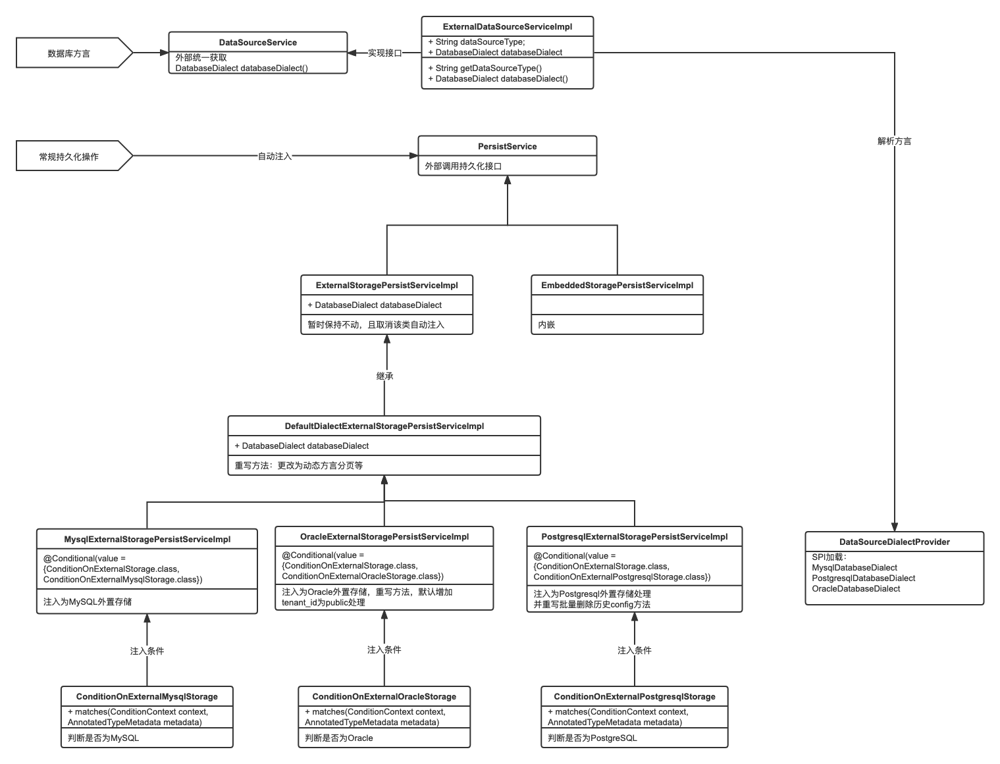

# 方案一、多种数据库方言实现的注入判断适配
## 一、基本说明

该种方案希望尽量不影响原有的SQL业务逻辑前提下进行实现。目前基于Nacos2.1版本，当前该种方案，在本地开发环境，已简单的适配核心的PersistService的处理，支持MySQL、Oracle、PostgreSQL。部分功能未测试，对于服务注册与配置等基础功能可以实现正常的维护操作。

核心类图如下所示：

最近代码梳理好后，会上传到仓库。

## 二、开发情况

当前方案基于Nacos2.1.0进行代码实现。

实现对Nacos底层多种数据源的支持，默认为MySQL，且需要通过配置SPI的方式声明实现，根据时间安排进行匹配支持PostgreSQL、Oracle、DB2等数据库的支持，先不考虑插件化、动态化，优雅扩展性等。

目前该开发优先级先确保常见的CRUD操作可以正常访问支持。

## 三、目前发现的兼容性问题处理

### 3.1、通用兼容性解决与设计

1、动态获取驱动配置及JDBC测试查询语句，核心逻辑在ExternalDataSourceProperties文件中，及调用数据库方言进行

2、某些查询需要返回主键问题，抽取为常量，并进行指定返回字段说明，RETURN_PRIMARY_KEYS。

3、某些类中的方法使用LIKE '%' ? '%'问题，更改为通用的方式

4、抽取类中的查询SQL中的分页代码为sqlInner局部变量，动态获取方言获取分页代码

5、ExternalStoragePaginationHelperImpl类中的fetchPage方法，更改调用为方言实现通用查询代码

6、对数据库的分页的计算方式(pageNo - 1) * pageSize，封装为2个单独方法，便于不同的数据库进行分页参数控制

### 3.2、PostgreSQL的兼容性问题：

已解决：

1、PostgreSQL数据库脚本相关梳理

未解决：

1、针对dump业务的removeConfigHistory方法，进行重写，目前删除时，未加上分页控制，待实现如何处理

### 3.3、Oracle的兼容性问题：

已解决：

1、Oracle数据库脚本相关梳理

2、PERMISSIONS表的RESOURCE字段名称冲突问题，创建表的时候，加上双引号，未来看看是否重命名该字段

3、主键自增长问题，目前采用手动创建序列和触发器的方式，对于Oralce11g的脚本

4、tenant_id默认空NULL查询的问题，目前自定义子类，重写相关方法，采用增加默认存储public空间判断的方式

5、分页SQL的问题，目前采用单独封装分页起始范围的方法，进行处理

未解决：

1、用户表boolean类型问题，但是在Oracle上没有报错，存储的是1，可以用。

